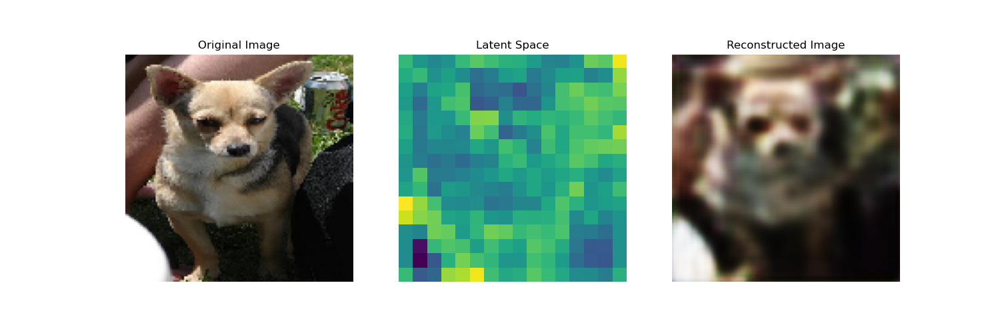
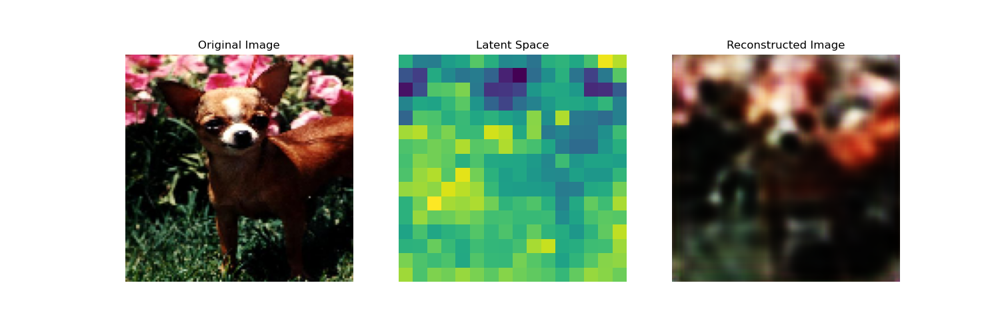
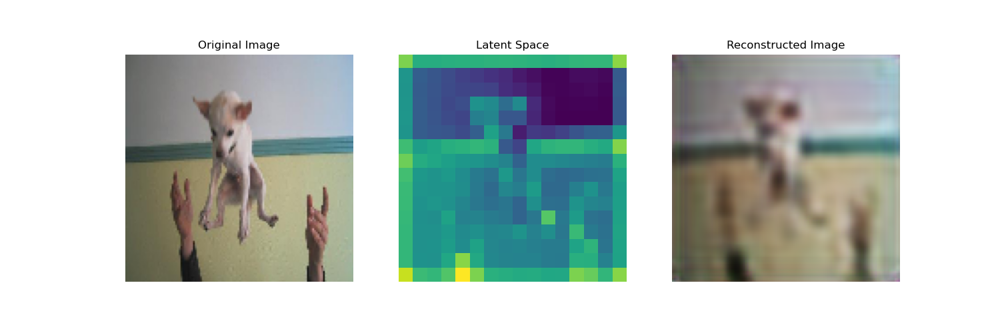
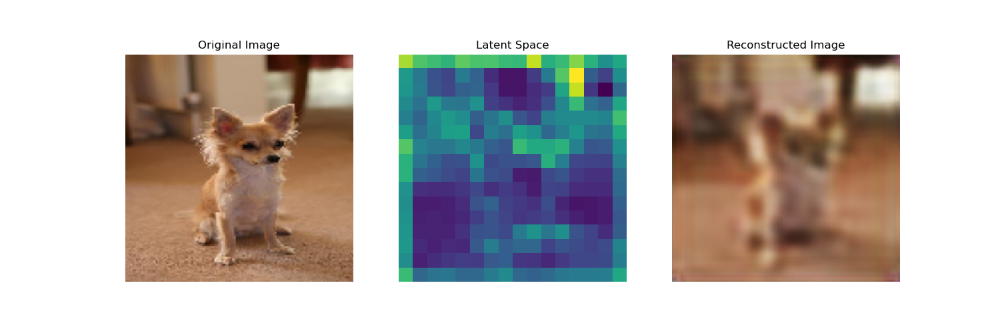

# Autoencoder Image Compression and Reconstruction
# Autoencoder Image Compression and Reconstruction

This repository demonstrates a simple autoencoder model for compressing and reconstructing images. The autoencoder is built using TensorFlow and Keras and is trained on a dataset of images to learn a compressed representation in the latent space, which can then be used to reconstruct the original images.

## Table of Contents

- [Introduction](#introduction)
- [Dependencies](#dependencies)
- [Usage](#usage)
  - [Loading Images](#loading-images)
  - [Defining the Autoencoder](#defining-the-autoencoder)
  - [Training the Model](#training-the-model)
  - [Reconstructing Images](#reconstructing-images)
- [Results](#results)

## Introduction

An autoencoder is a type of neural network used to learn efficient codings of input data. This repository implements a simple convolutional autoencoder that takes images as input, compresses them into a latent space representation, and then reconstructs the images from this representation.

## Dependencies

To run the code, you'll need the following libraries:

- Python 3.x
- TensorFlow
- Keras
- NumPy
- Matplotlib

You can install the necessary packages using pip:

```bash
pip install tensorflow keras numpy matplotlib
```
Usage
Loading Images
The script loads all images from a specified directory and resizes them to 128x128 pixels. The images are then converted into NumPy arrays and normalized to the range [0, 1].
```python
directory = 'images/images/n02085620-Chihuahua'
all_images = []

for filename in os.listdir(directory):
    if filename.endswith(".jpg") or filename.endswith(".png"):
        img_path = os.path.join(directory, filename)
        try:
            img = image.load_img(img_path, target_size=(128, 128))
            img_data = image.img_to_array(img) / 255.0
            all_images.append(img_data)
        except Exception as e:
            print(f"Error loading '{filename}': {e}")
            continue

all_images = np.array(all_images)
```
Defining the Autoencoder
The autoencoder is defined using convolutional layers for both encoding and decoding processes. The encoder compresses the input image into a latent space, while the decoder reconstructs the image from this latent space.
```python
input_img = Input(shape=(128, 128, 3))
x = Conv2D(16, (3, 3), activation='relu', padding='same')(input_img)
x = MaxPooling2D((2, 2), padding='same')(x)
x = Conv2D(8, (3, 3), activation='relu', padding='same')(x)
x = MaxPooling2D((2, 2), padding='same')(x)
x = Conv2D(8, (3, 3), activation='relu', padding='same')(x)
encoded = MaxPooling2D((2, 2), padding='same')(x)

x = Conv2D(8, (3, 3), activation='relu', padding='same')(encoded)
x = UpSampling2D((2, 2))(x)
x = Conv2D(8, (3, 3), activation='relu', padding='same')(x)
x = UpSampling2D((2, 2))(x)
x = Conv2D(16, (3, 3), activation='relu', padding='same')(x)
x = UpSampling2D((2, 2))(x)
decoded = Conv2D(3, (3, 3), activation='sigmoid', padding='same')(x)
```
Training the Model
The autoencoder model is compiled using the Adam optimizer and binary cross-entropy loss function. It is then trained for 500 epochs with a batch size of 32.
```python
autoencoder = Model(input_img, decoded)
autoencoder.compile(optimizer='adam', loss='binary_crossentropy')
autoencoder.fit(all_images, all_images, epochs=500, batch_size=32, shuffle=True)
```
Reconstructing Images
After training, the autoencoder is used to reconstruct the images. The script also displays the original images, their latent space representations, and the reconstructed images for comparison.
```python
reconstructed_images = autoencoder.predict(all_images)

for i, img_data in enumerate(all_images[:5]):
    plt.figure(figsize=(15, 5))

    plt.subplot(1, 3, 1)
    plt.title('Original Image')
    plt.imshow(img_data)
    plt.axis('off')

    plt.subplot(1, 3, 2)
    encoder = Model(input_img, encoded)
    latent_representation = encoder.predict(np.expand_dims(img_data, axis=0))
    latent_img = np.mean(latent_representation, axis=-1)
    latent_img = np.squeeze(latent_img)
    plt.title('Latent Space')
    plt.imshow(latent_img)
    plt.axis('off')

    plt.subplot(1, 3, 3)
    plt.title('Reconstructed Image')
    reconstructed_img = reconstructed_images[i]
    plt.imshow(reconstructed_img)
    plt.axis('off')

    plt.show()
```
Results
The autoencoder compresses the images into a latent space representation and then reconstructs them. The results show how well the autoencoder can learn and recreate the original images from the compressed data.

### Example Results

#### Original Image vs. Reconstructed Image








#### Latent Space Representation


*Note: The latent space images are visualized by taking the average over the feature maps in the latent representation.*


